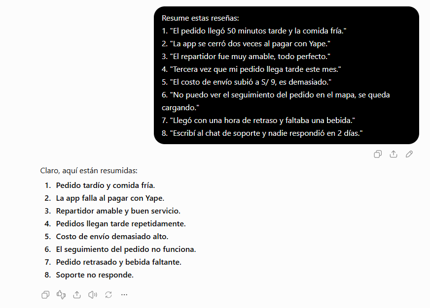
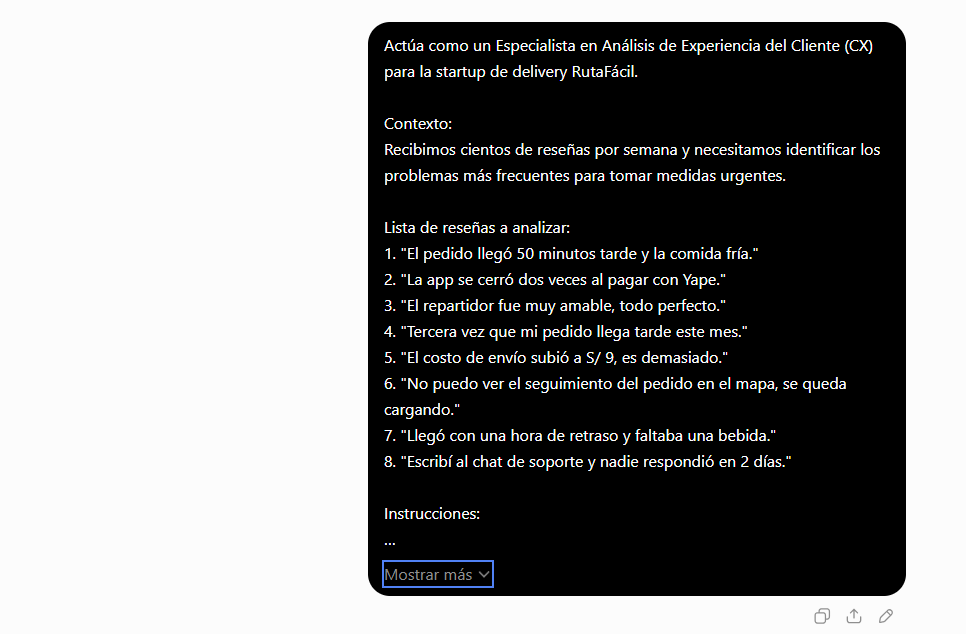
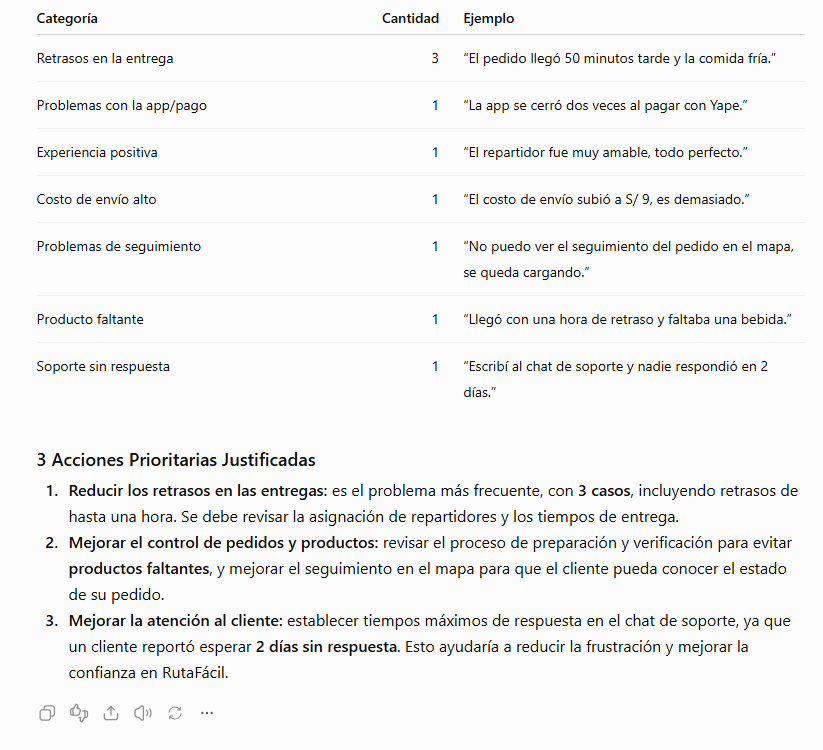
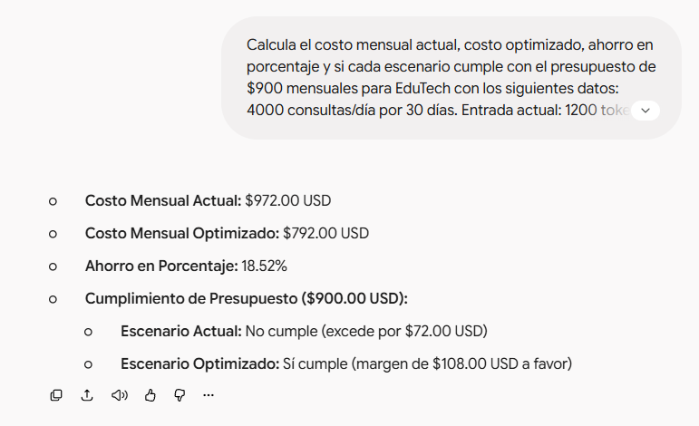
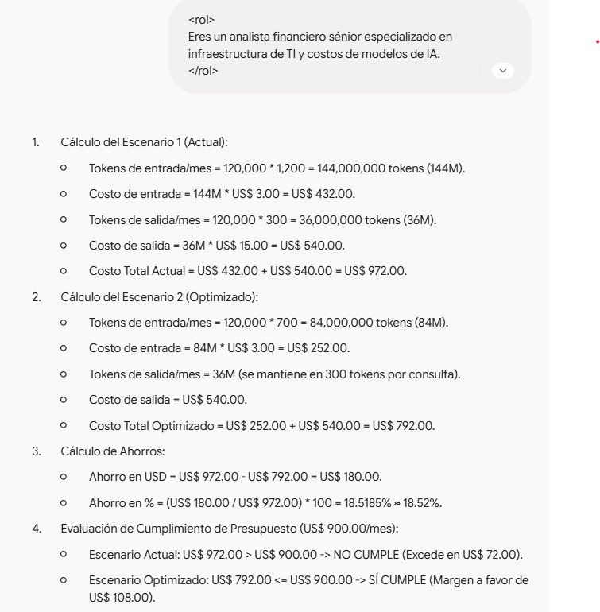

# Evaluación 02: Diseño de Interfaces de Programación Avanzado

## Pregunta 1: Anatomía de un prompt efectivo (ChatGPT)

### 1.1 Tabla de Componentes del Prompt
| Componente | Descripción en RutaFácil |
| :--- | :--- |
| **Rol** | Especialista en Análisis de Experiencia del Cliente (CX) |
| **Contexto** | Startup de delivery RutaFácil busca identificar problemas frecuentes en reseñas |
| **Tarea** | Categorizar reseñas, contar frecuencia y proponer 3 acciones prioritarias |
| **Formato de salida** | Tabla Markdown (Categoría \| Cantidad \| Ejemplo) y 3 acciones justificadas |
| **Restricciones** | Mapear correctamente la reseña 7 en ambas categorías y ser preciso |

---

### 1.2 Prompts Utilizados

#### Prompt Vago:
```text
Resume estas reseñas:
1. "El pedido llegó 50 minutos tarde y la comida fría."
2. "La app se cerró dos veces al pagar con Yape."
3. "El repartidor fue muy amable, todo perfecto."
4. "Tercera vez que mi pedido llega tarde este mes."
5. "El costo de envío subió a S/ 9, es demasiado."
6. "No puedo ver el seguimiento del pedido en el mapa, se queda cargando."
7. "Llegó con una hora de retraso y faltaba una bebida."
8. "Escribí al chat de soporte y nadie respondió en 2 días."
```
#### Prompt Estructurado Final:
```text
Actúa como un Especialista en Análisis de Experiencia del Cliente (CX) para la startup de delivery RutaFácil.

Contexto:
Recibimos cientos de reseñas por semana y necesitamos identificar los problemas más frecuentes para tomar medidas urgentes.

Lista de reseñas a analizar:
1. "El pedido llegó 50 minutos tarde y la comida fría."
2. "La app se cerró dos veces al pagar con Yape."
3. "El repartidor fue muy amable, todo perfecto."
4. "Tercera vez que mi pedido llega tarde este mes."
5. "El costo de envío subió a S/ 9, es demasiado."
6. "No puedo ver el seguimiento del pedido en el mapa, se queda cargando."
7. "Llegó con una hora de retraso y faltaba una bebida."
8. "Escribí al chat de soporte y nadie respondió en 2 días."

Instrucciones:
1. Analiza cada reseña. La reseña 7 contiene dos problemas ("retraso" y "producto faltante"), por lo que debes contar el problema en ambas categorías correspondientes.
2. Devuelve los resultados únicamente en este formato:
   - Una tabla en Markdown con las columnas: Categoría | Cantidad | Ejemplo
   - Una sección de "3 Acciones Prioritarias Justificadas".

Restricciones:
- Sé preciso con el conteo de frecuencias.
```

---

### 1.3 Capturas de Evidencia
#### Respuesta Prompt Vago:


#### Respuesta Prompt Estructurado:


---

### 1.4 Verificación del Conteo y Tratamiento de la Reseña 7
- **Conteo Manual:**
  - *Retrasos / Demoras:* 3 (Reseñas 1, 4, 7)
  - *Fallas Técnicas App / Pagos / Mapa:* 2 (Reseñas 2, 6)
  - *Producto faltante / Calidad:* 2 (Reseñas 1, 7)
  - *Soporte:* 1 (Reseña 8)
  - *Tarifas:* 1 (Reseña 5)
  - *Comentario Positivo:* 1 (Reseña 3)
- **Tratamiento de la Reseña 7:** En el prompt vago, la IA únicamente acortó las frases sin categorizar ni contar las frecuencias. En el prompt estructurado, agrupó la reseña 7 en la categoría principal de "Retrasos en la entrega" (3 casos) y extrajo "Producto faltante" como una categoría individual.

---

### 1.5 Registro de Métricas
- **Modelo:** GPT-4o
- **Plan:** Gratuito / Plus
- **Prompts requeridos:** 2
- **Tokens aproximados:** ~450 entrada / ~350 salida

---

## Pregunta 2: Optimización de Costos de API de LLM para EduTech (Claude)

### 2.1 Capturas de Evidencia
#### Respuesta Prompt Directo:


#### Respuesta Prompt XML con Autocrítica:


---

### 2.2 Cuadro Comparativo de Costos

| Métrica | Escenario Actual | Escenario Optimizado | Diferencia / Ahorro |
| :--- | :---: | :---: | :---: |
| **Tokens de Entrada / Consulta** | 1,200 | 700 | -500 tokens (-41.67%) |
| **Tokens de Salida / Consulta** | 300 | 300 | 0 |
| **Costo Mensual Entrada** | $432.00 USD | $252.00 USD | -$180.00 USD |
| **Costo Mensual Salida** | $540.00 USD | $540.00 USD | $0.00 USD |
| **Costo Total Mensual** | **$972.00 USD** | **$792.00 USD** | **-$180.00 USD (-18.52%)** |
| **¿Cumple Presupuesto ($900)?** |  No ($72 de exceso) |  Sí ($108 de margen) | — |

---

### 2.3 Análisis de Resultados
- **Efectividad del Prompt XML:** La inclusión de etiquetas delimitadoras (`<datos>`, `<tarea>`, `<formato>`) y la etiqueta de autocrítica `<instruccion_autocritica>` forzó al modelo a realizar un razonamiento explícito paso a paso antes de emitir los montos finales, previniendo errores de cálculo en el volumen de consultas mensuales (120,000 en total).
- **Viabilidad Financiera:** La optimización en los tokens de entrada (reduciendo contexto innecesario en el prompt del sistema) permite recortar el gasto mensual en un **18.52%**, logrando que el proyecto de EduTech sea financieramente viable dentro del presupuesto aprobado de $900 USD.

---

### 2.4 Registro de Métricas
- **Modelo:** Claude 3.5 Sonnet
- **Plan:** Gratuito / API
- **Prompts requeridos:** 2
- **Tokens aproximados:** ~380 entrada / ~420 salida